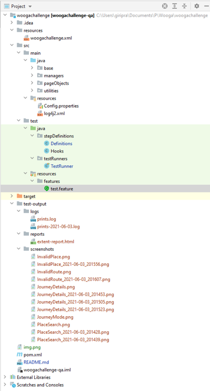
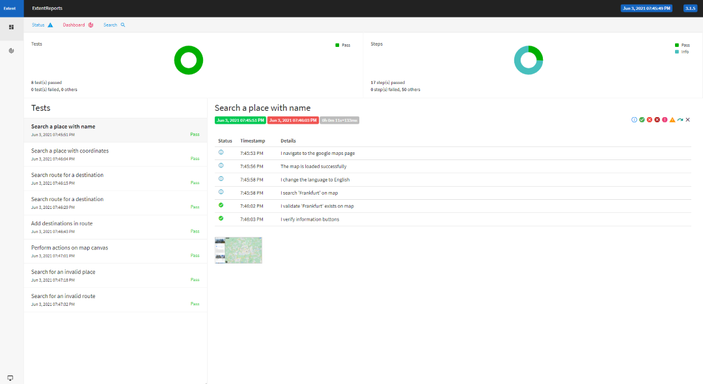

# Wooga - QA Challenge

This project is to perform actions and verify google map functionalities. The project is created in such a way that
every scenario is independent and browser will get closed after each execution. It uses following technology stack:

- Selenium
- Cucumber BDD Framework
- Java
- Maven
- Jenkins
- log4j2

### _Note_

_Since test cases are developed on google map with english language, all the error msgs are also verified in english
language only. To make test cases compatible with other languages, google map's language is first changed to english
before executing each test case. Though this can be changed in next version, by creating a translator utility class_

## Getting Started

- ### Prerequisites
    - Java 8 and maven should be installed
    - Java and Maven Paths should be configured
    - Jenkins and Jenkins-cli(optional)

- ### Navigation



1. woogachallenge.xml ->  To import Jenkins job
2. base -> Base class which is inherited by other classes
3. managers -> Driver manager class with singleton pattern so that only one instance of webdriver instance gets
   instantiated. PageObjectManager class to create page object such that if there are multiple scenarios, only one
   instance of page object gets created
4. pageObjects -> PageObjectManager class with page object pattern, it has one class for each page with page objects and
   method
5. utilities -> Element and Wait utilities which can be used across projects
6. config.properties -> configuration file
7. log4j2.xml -> log4j configuration file
8. stepDefinitions -> Definitions contains implementation of cucumber steps
9. hooks -> Contains functions which run before and after of each scenario
10. testRunner -> Junit class used for running the execution
11. features -> Feature files with cucumber steps in gherkin language. All the scenarios are mentioned here
12. test-output:
    - logs -> logs with execution steps
    - reports -> extent report in html format with all cucumber steps, verifications and screenshots
    - screenshots -> contains screenshots of all passed and failed scenarios

## Running the tests

Go to src\main\test\testRunners folder and run TestRunner.java class. You can also use below maven command in terminal
for execution:

 ```
 mvn clean test
 ```

## Reports

- Extent reports can be found at test-output\reports folder in html format. The report has all the test cases under a
  feature with test steps. The report also contains image of necessary steps which can be enlarged on clicking. Also,
  whenever there is failure an image is captured and attached to make the debugging easy.



- Screenshots can be found at test-output\screenshots folder.
- Logs of each step are captured in test-output\logs folder.

## Jenkins Integration

Open woogachallenge.xml file under resources folder. Provide the complete path of pom.xml of this project from your
directory in local machine in following line in the xml file

 ```
<rootPOM>D:\Projects\woogachallenge\pom.xml</rootPOM>
 ```

Install Jenkins-cli in Jenkins and run following command to import Jenkin job

 ```
java -jar jenkins-cli.jar -s http://server auth username:password create-job wooga-challenge < woogachallenge.xml
 ```

A job with name wooga-challenge should get created. On running this job, test cases will be executed on the local
machine.

