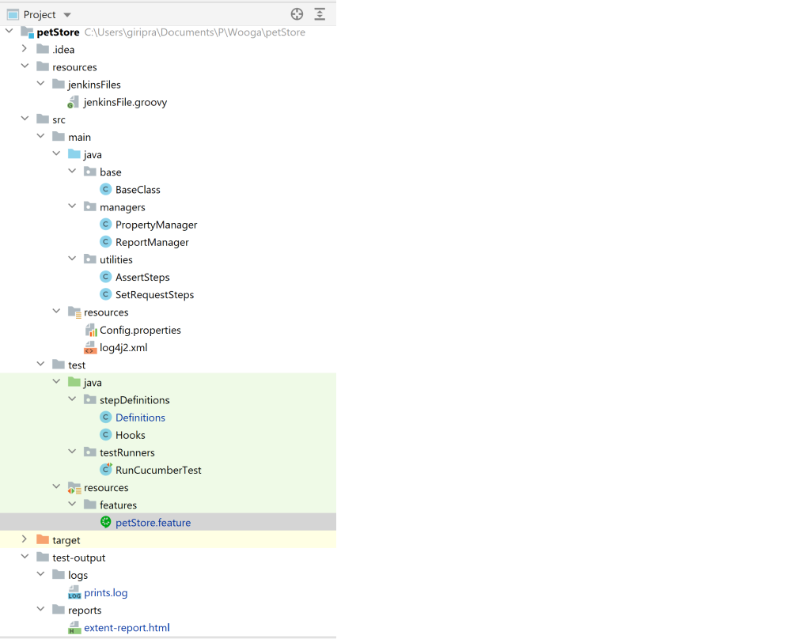
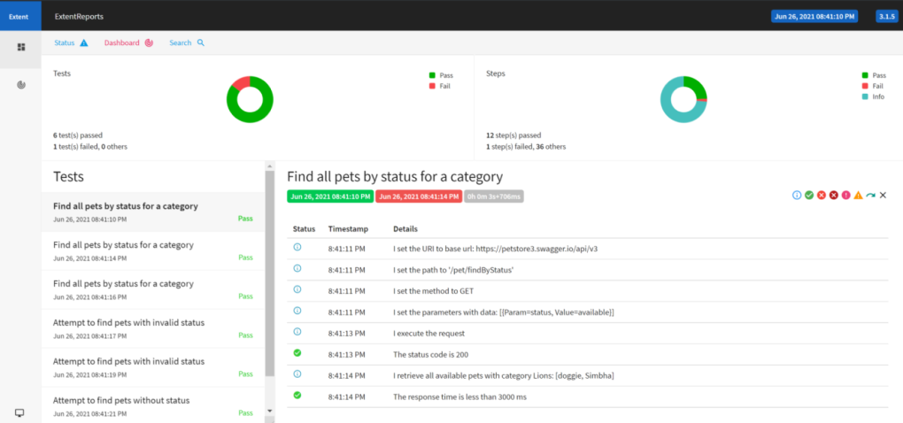
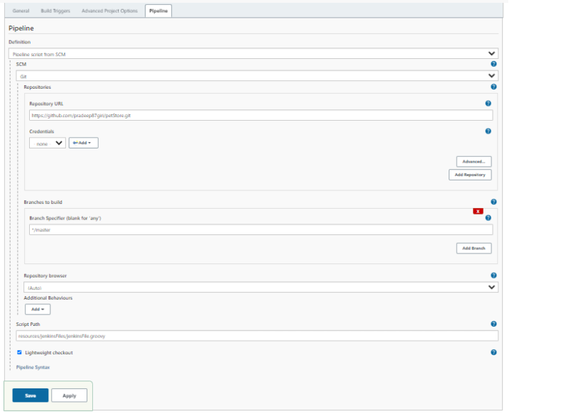

# Pet Store

This project is to test Pet Store API through automation framework. Every scenario in this project can be run
independently.

## Tools & Libraries

- Rest-Assured: - Java library for Api Testing
- Cucumber-JVM:- BDD Framework
- JAVA: - Programming language
- Maven: - Build tool
- Jenkins: - Continuous Integration
- Git: - Version Control
- Github: - Git repository hosted server
- Intellij Or Eclipse: - Integrated Development Environment
- Log4j2: - Simple Logging Utility for Java
- Extent Reports - Reporting library for Java

## Getting Started

- ### Prerequisites
    - Java 8 and maven should be installed
    - Java and Maven Paths should be configured
    - Git
    - Jenkins with Pipeline and HTML publisher plugin

- ### Repository
  Github repo url: https://github.com/pradeep87giri/petStore.git

- ### Navigation
  

1. **jenkinsFile.groovy** ->  Jenkine file for pipeline jobs for CI integration. Path:
   resources/jenkinsFiles/jenkinsFile.groovy
2. **base** -> Base class containing references of log, config, report and request objects
3. **managers** ->
    - PropertyManager: Contains functions to load and read config properties
    - ReportManager: Contains functions to initialize and flush extent reports
4. **utilities** -> Reusable utilities which can be used in other projects
    - AssertSteps: Contains functions to validate response
    - SetRequestSteps: Contains functions to form an API request
5. **resoucres** ->
    - config.properties: Configuration file
    - log4j2.xml: Configuration file for logging
6. **stepDefinitions** ->
    - Definitions: Every step defined in Feature file needs to be implemented in Definitions Class. Example:
      ```
      @Given("^I set the URI to base url$")
      public void setBaseURL() {
      String baseUri = props.getProperty("baseUrl");
      setRequestSteps.setBaseUri(requestSpec, baseUri);
      }
    - Hooks: Contains functions which run before and after every test case. This helps in logging and reporting of all
      test cases
7. **testRunner** -> Junit class used for running the execution. This file also glues and features and definitions.
   Example:
   ```
   @RunWith(Cucumber.class)
   @CucumberOptions(
   features = {"src/test/resources/features"},
   plugin = {"pretty", "html:target/cucumber-reports", "json:target/cucumber.json"},
   glue = {"stepDefinitions"}
   )
8. **features** -> Feature files with cucumber steps in gherkin language. These files contain all the test cases of
   various scenarios. Example:
    ```
    Scenario Outline: Attempt to find pets without status
    When I set the path to "<path>"
    And I set the method to GET
    And I execute the request
    Then The status code is "400"
    And I verify the error msg on not providing status

    Examples:
      | path              |
      | /pet/findByStatus |
9. **test-output** ->
    - logs: Contains logs with timestamp for debugging
    - reports: A new extent report in html format generates with each run. It contains all cucumber steps and
      verifications

## Running the tests

There are different ways to execute test cases:

1. Go to src\main\test\testRunners folder and run TestRunner.java class.
2. Run maven command in terminal: **mvn clean test**
3. Create a jenkins pipeline job, use jekinsFile.groovy script in it and run the job.

## Reports

- Extent reports can be found at test-output\reports folder in html format. The report has all the test cases under a
  feature with test steps. It also shows validation points, number of test cases/steps and total execution time.

  

- Logs of each step gets captured in test-output\logs folder.

## CI Integration

Steps to integrate automation framework with Jenkins:

- Create a new pipeline job on your Jenkins
- Configure the job and click on Pipeline tab
- Choose Git as SCM nad fill following info:
    - Enter repository URL - https://github.com/pradeep87giri/petStore.git
    - Branch Specifier: */master
    - Script Path: resources/jenkinsFiles/jenkinsFile.groovy

  

### _Note_

***Usually reseponse time is much greater than 200ms and may cause test cases failure. Also, last test case always fails
because response status code is 400 instead of 404, which looks like a potential bug.***


